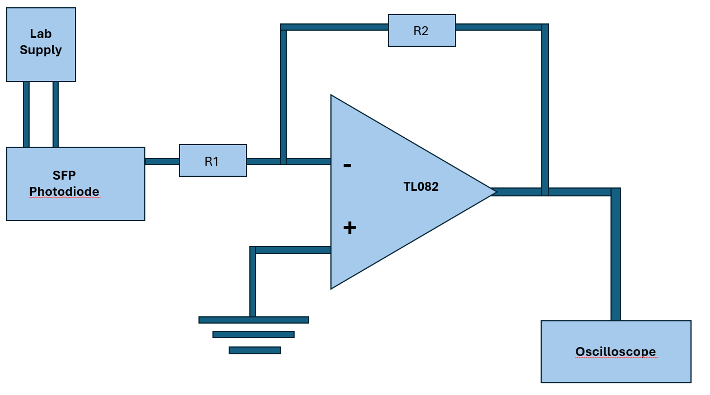
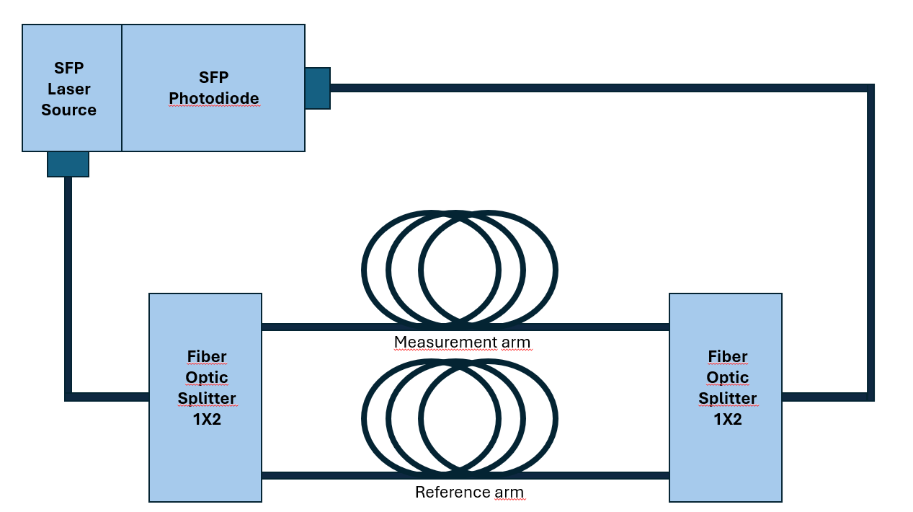

# SFP module for experimental purposes

# Authors 
- Jakub Łasocha
- Jan Skiba 

# Description of the project 
The main goal of our project was to investigate the feasibility of utilizing low-cost, commercially available digital SFP (Small Form-factor Pluggable) transceivers (specifically the CBF HD-S3112-20LCD model operating at 1310 nm) for analog and DIY applications. We wanted to verify to what extent a stock module can be hacked to be a useful part of budget-friendly optoelectronic experiments. The original objective was to construct an optical fiber interferometer, which later shifted toward just controlling a SFP board and using it in the experimental physics environment. It stands in opposite to the most hacking SFP hacking projects present on github, where SFP boards are used in the DIY projects related to the communication, IT projects. 

# Science and tech used 
The project sits at the intersection of optoelectronics, fiber-optics and analog electronics.

* **Wave Optics in the Single-Mode Regime:** Working with 1310 nm wavelengths over SMF-28 fiber ensures stable propagation strictly within the fundamental mode. This stands in contrast to visible red light (650 nm), which behaves as multi-mode in the same fiber, generating unstable spatial speckle patterns and longitudinal mode hopping which were observed by us.

* **Transimpedance Amplifier:** We attempted to measure the analog output of the photodiode by connecting its pins to transimpedance amplifier (circuit based on [TL082][2]). In theory it should allow us to convert the photodiode current into a measurable voltage on an oscilloscope. However signal got overwhelmed by the enviroment's noise (50 Hz).
\
\

* **Optical-Fiber Mach-Zender Interferometer:** We attempted to build a forementioned interferometer. We build a fiber-architecture for that, however we got stuck at the issues we detector module. Below there is a schematic of proposed interferometer.
\
\

* **Laser Current Modulation:** Utilizing an Arbitrary Waveform Generator (AWG) to directly inject high-frequency (MHz) signals into the transmission lines while controlling the DC offset to maintain the linear operating range of the laser diode. This transforms electrical voltage variations directly into optical signal at a wavelength of 1310 nm.

# State of the art 
In the field of experimental physics and optical engineering, setting up even a basic experiment is notoriously expensive. Specialized laboratory-grade optical sources (such as highly stable lasers) and various optical detectors easily cost thousands of dollars. Beyond the financial barrier, configuring these instruments requires sensitive analog circuitry, precise thermal regulation, and delicate fiber alignment, making budget-friendly or DIY optoelectronic prototyping highly inaccessible for students and hobbyists. 

In parallel, there is a thriving ecosystem of various hacking projects on platforms like GitHub. However, when doing a review of these repositories, it becomes clear that they almost exclusively approach SFP modules from an IT, networking, or pure software perspective. Almost all of these GitHub projects treat the SFP as a complete digital "black box" that outputs packets and bytes. They are heavily oriented toward programming, digital communication standards, and strictly IT-related configurations: protocols, routers, networks.

There is a massive gap in the open-source community when it comes to utilizing SFPs for optics physics and engineering purposes. While research literature shows that the raw optoelectronic components inside an SFP (the laser diode and photodiode) [possess potential for analoge hacking][1], the DIY community has rarely attempted to use SFPs modules for raw, analog experimental physics applications. And that's what we want to do.

# What next?
Hacked SFP board is an universal low-cost laser source and laser detection module (at its particular working wavelength) which could be used in many physics experiments related to the fiber-optics or as a platform for various telecommunication projects available on github.
### Optical-Fiber Interferometer:
Such SFP could be used as a laser source and signal detector in the project of building a fiber-optic interferometer of various architectures, for example Michelson or Mach-Zender. SFP module already provides an easy, already fabricated way of coupling the fiber directly to the laser diode and photodiode and (relatively) straightforward way of controlling the laser diode as well as the detector.\
**Challenges:** Proposed Macht-Zender architecture requires a optical length difference between the arms of interferometer in the scale of milimeters. It's quite difficulte to achieve because the cheap, commercialy avaible splliters don't have a systematic, repeatable length of fiber inside of them thus it's really difficult to manufacture interferometers arms of the desired length.

###  Measuring speed of light:
 By coupling the laser diode output with photodiode with a long optical fiber we can measure the speed of light. By measuring signal driving the laser diode and comparing it to the output of the photodiode we can calculate the time of propagation of the signal in the fiber. \
**Challenges:**  For proper measurment, used fiber should have length of at least several dozen meters and laboratory equipment.

### Fiber Optic Gyroscope:
 SFP could be again used as laser source and detector in the project of fiber-based gyroscope which utilizes Sagnac interferometer and Sagnac effect to measure angular momentum of the whole system. The fiber gyroscope itself was made in lots of amateur projects, SFP makes it easier by combining the laser source and detection system in one small, cheap board.\
**Challenges:**  It demands a fiber length of at least 100m as sensivity is related to the length of the loop.

# Sources 
- *"Undergraduate Experiments in Optics Employing a Fiber Optic Version of the Mach-Zehnder Interferometer"* https://opg.optica.org/abstract.cfm?uri=ETOP-2001-PDP464
- *"5G-Compatible IF-Over-Fiber Transmission Using a Low-Cost SFP-Class Transceiver"* https://ieeexplore.ieee.org/document/9721876
- *"Hacking a SFP Module into a fiber-optic gyroscope and measure the speed of light"* https://www.youtube.com/watch?v=HszGtGsFlJo
- *"3D printed Fiber Optic Gyroscope (Sagnac Interferometer)"* https://www.youtube.com/watch?v=oIEbDm0QwG8
- *"Sagnac interferometer Fiber Optic Gyroscope ( FOG ) construction and testing"* https://www.youtube.com/watch?v=Gsat054VEp4
- *"SFP break out board"* https://github.com/aewallin/SFP-Breakout-Board
- *"SFP break out board"* https://osmocom.org/projects/misc-hardware/wiki/Sfp-breakout
- *"SFP-experimenter"* https://osmocom.org/projects/misc-hardware/wiki/Sfp-experimenter
- *"Optical power meter with SFP"* https://hackaday.io/project/21599-optical-power-meter-with-sfp-and-ddm-protocol
- *"SFP-2-SMA Board, 2018-03"* https://github.com/aewallin/SFP2SMA_2018.03

[1]: https://ieeexplore.ieee.org/document/9721876
[2]: https://www.ti.com/lit/ds/symlink/tl082-n.pdf